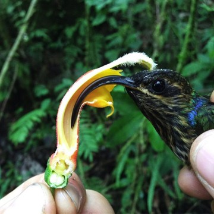
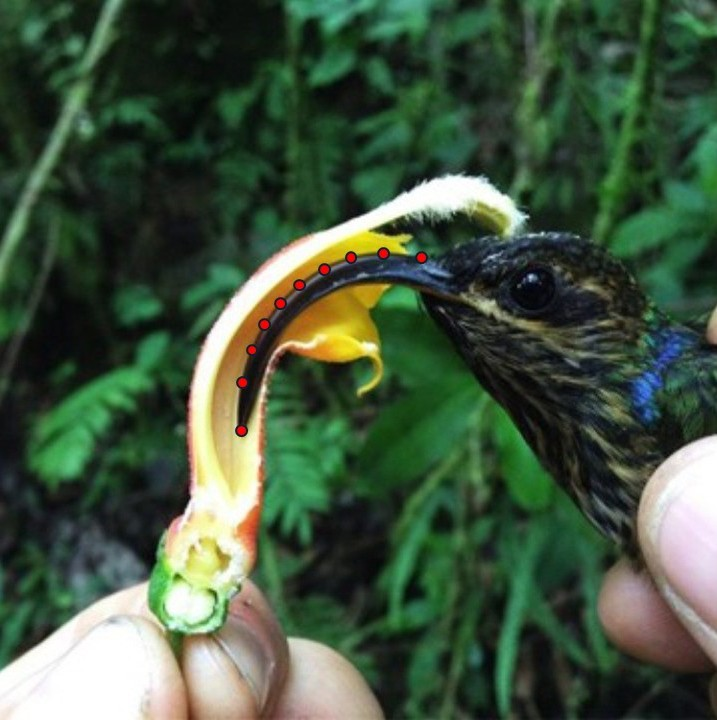

<p align="left">
  
</p>


<br>

### Installation

You can install the development version of `curvr` by:

``` r
# install.packages("devtools")
devtools::install_github("mannfred/curvr")
```
<br>
<br>


### Citation
If you find this package useful, please cite:

```
@article{boehm_2022,
  title={Plant-pollinator specialization: Origin and measurement of curvature},
  author={Boehm, Mannfred M.A. and Jankowski, J.E. and Cronk, Q.C.B.},
  year={2022},
  journal={The American Naturalist},
  volume={199},
  number={2},
  pages={206--222}
}
```

[Click here](https://mannfred.github.io/media/pdfs/Boehm_etal_2022_AmNat.pdf) for a .pdf of the paper, 
where we outline the motivation for this package, define "curvature", and demonstrate the use of this package 
on *Epimedium* nectar spurs. 

<br>
<br>

### Example

This photograph of *Centropogon granulosus* and Buff-tailed Sicklebill was taken by 
[Julian Heavyside](https://scholar.google.ca/citations?hl=en&user=5oVlLOkAAAAJ&view_op=list_works&sortby=pubdate) in the southeastern Andes of Peru:

<p align="left">
  
</p>

<br>

A common practice in ecology is to measure and compare traits. 
For example, in a comparative study, we might ask "how curved is the bill of this hummingbird?". 
One way to measure bill curvature is to add landmarks along the 
dorsal side of the bill using `geomorph`. 
Given these landmark data, `curvr` can find the best-fit spline, and then calculate 
total curvature from said spline.  


``` r
library(curvr)
library(geomorph)

# landmark the .jpg in this R package's directory
geomorph::digitize2d(filelist="man/figures/Figure_A2.jpg", nlandmarks=10, tpsfile="sicklebill.tps", verbose=F)
```
<br>

Typically, one would need to be more rigorous with landmarking. 
E.g. we have not told `digitize2d()` what the scale is
(although curvature is scale invariant, it's still good practice). 


<p align="left">
  
</p>

<br>

`curvr` fits a spline to these 10 landmarks (in red) and calculates the curvature of the spline.

```r
# import the .tps file for curve-fitting
tps <- readland.tps(file="man/figures/sicklebill.tps")

# calculate curvature (curvr gives radians)
ktot <- curvr::curvature_spline(tps[,,1], x_range=range(tps[,,1]))$Ktot

# convert to degrees
ktot * (180/pi)
# 57.7 degrees
```

<br>
<br>

